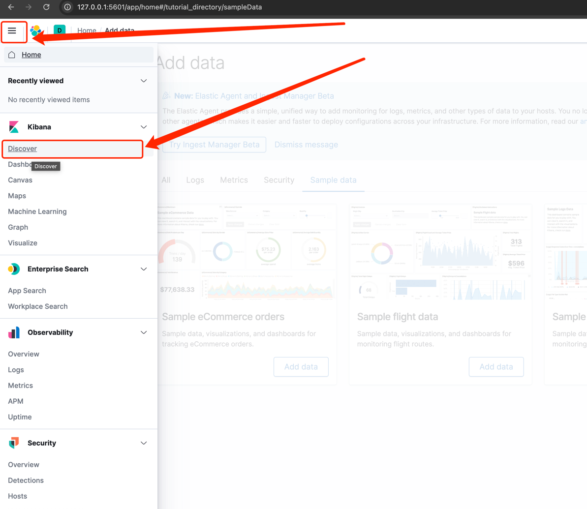
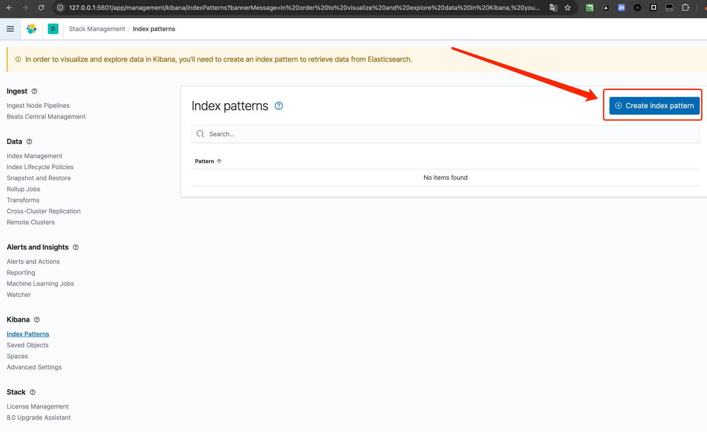
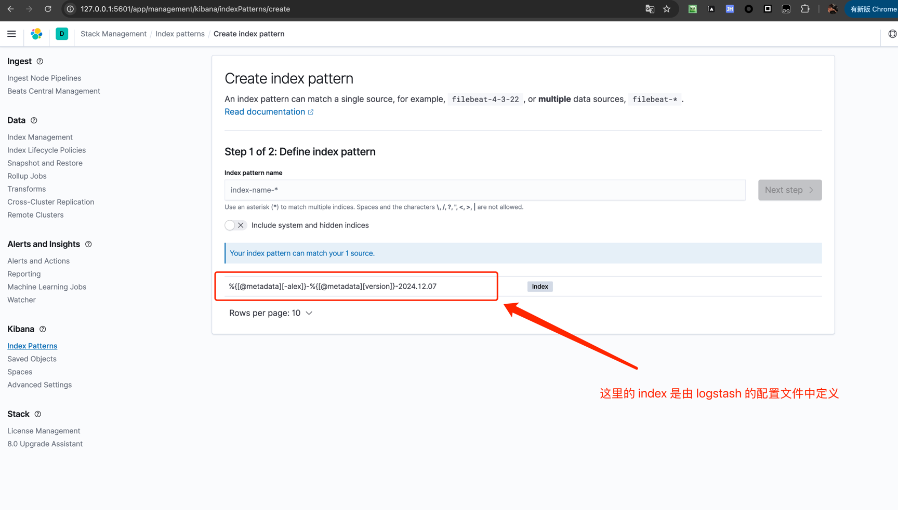
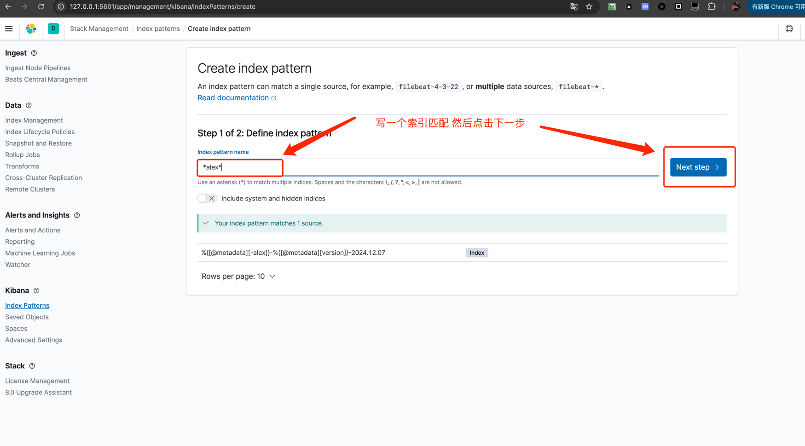
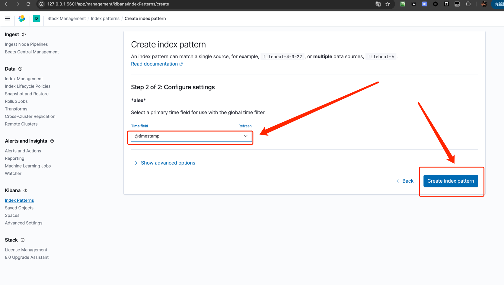
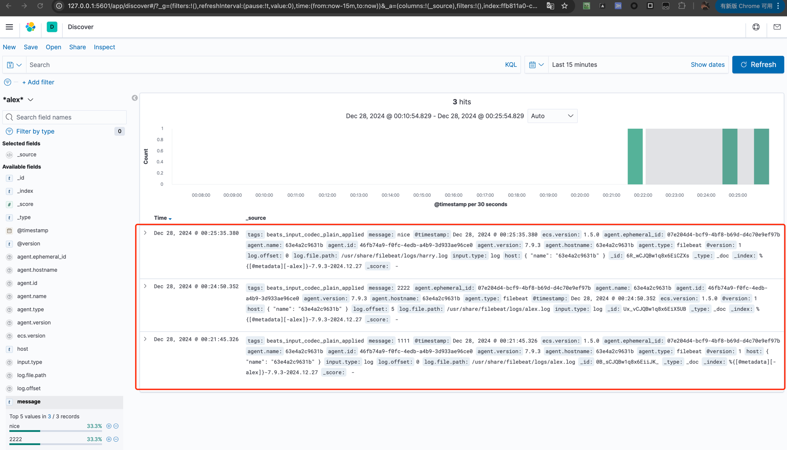

# filebeat

- [filebeat 官方文档地址](https://www.elastic.co/guide/en/beats/filebeat/index.html)

## 在 kibana 中查看 filebeat 导入的内容

1. 浏览器访问 `http://localhost:5601/` 进入 kibana 页面，点击左上角的 Discover

2. 然后点击 `Create index pattern`

3. 我们可以看到会存在我们在 logstash 中配置的 index，然后填写 index pattern，（当然需要与 logstash 中的索引要有关系）点击 `Next step`

填写索引匹配规则

4. 选择时间字段，然后点击 `Create index pattern`

5. 然后重新回到 Discover 页面，就可以看到我们导入的内容了

