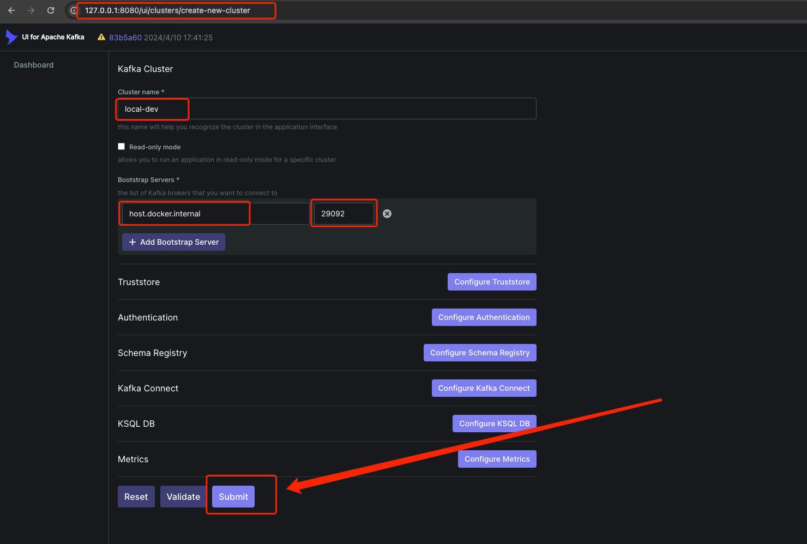

# kafka

这里的 `docker-compose.yml` 文件用来搭建一套单节点的 `zookeeper` 和单节点 `kafka` 环境，并且在 `8080` 端口提供 `kafka-ui` 管理界面。

详细可参考

- [conduktor/kafka-stack-docker-compose](https://github.com/conduktor/kafka-stack-docker-compose)：通过 docker compose文件构建一个完整的kafka服务栈。
- [provectus/kafka-ui](https://github.com/provectus/kafka-ui)：Apache Kafka管理专用的开源Web界面

